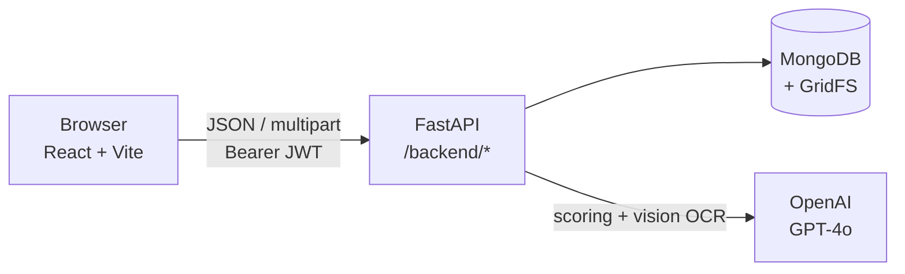
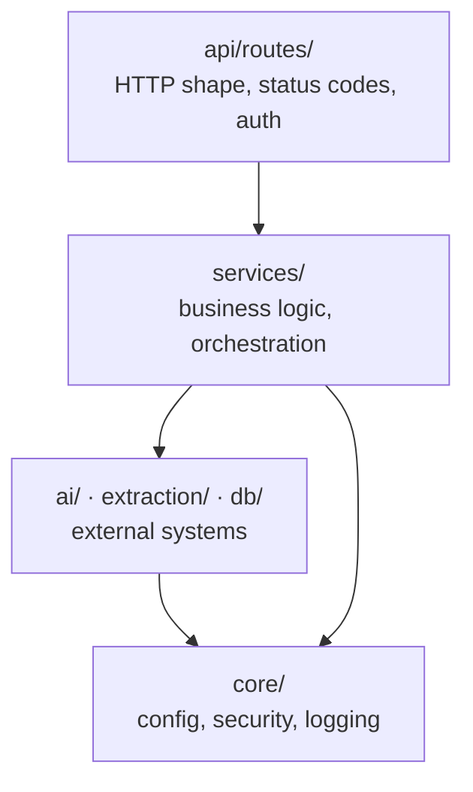
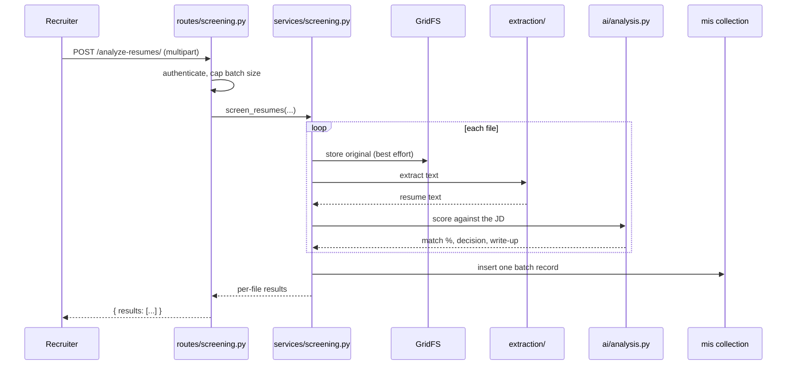
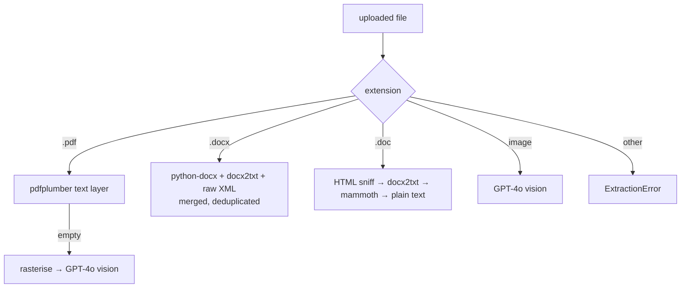
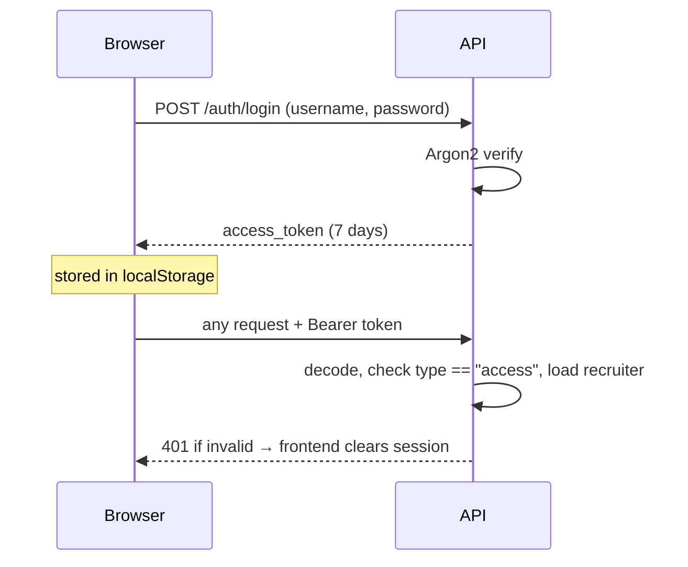

# Architecture

## System shape



The frontend is a static bundle; it holds no secrets and talks to exactly one
backend, whose base URL comes from `VITE_API_URL`. Every route is served under
`API_PREFIX`, which defaults to `/backend`.

## Backend layers

Dependencies run one way. Nothing lower ever imports something above it, which
is what keeps the business logic testable without a running server.



| Layer | Responsibility | Must not |
|---|---|---|
| `api/routes` | Parse the request, choose a status code, enforce auth | Contain business rules or touch the database |
| `services` | Own the workflow and the rules | Know about `Request`, `Response` or HTTP status codes |
| `ai`, `extraction`, `db` | Talk to one external system each | Know why they were called |
| `core` | Configuration, hashing, tokens, logging | Import anything above it |

Errors follow the same direction. A service raises a domain exception —
`ExtractionError`, `AnalysisError`, `RecruiterAlreadyExists`, `InvalidDateType`
— and the route translates it into an HTTP status. Services never raise
`HTTPException`.

## The screening pipeline

The one flow worth understanding end to end. A recruiter submits a job
description, a role type, a level, and up to 50 files.



Four decisions in that flow are deliberate:

**File storage is best-effort.** If GridFS fails, the screening still runs and
returns results; the history entry simply carries no `file_id`. A storage
outage should not cost a recruiter the analysis they waited for.

**One failure does not sink the batch.** An unreadable resume is caught per
file and recorded with `decision: "Error"`. The other files still get screened.

**Blocking work runs off the event loop.** The OpenAI SDK and every PDF/DOCX
parser are synchronous. They are dispatched through `run_in_threadpool`, so one
slow upload doesn't stall every other request on the server.

**One MIS record per batch, not per file.** The record holds batch totals plus a
`history` array with an entry per resume. See [data-model.md](data-model.md).

## Text extraction

Resumes arrive in whatever format the job board produced, so extraction is a
chain of fallbacks rather than a single call.



Two cases explain the shape:

- **A `.doc` from a job board is usually HTML.** Naukri and similar exports use
  the `.doc` extension for HTML files, so the extractor sniffs the content
  before trusting the extension.
- **`.docx` needs three passes merged.** `python-docx` reads body text, tables,
  headers and footers; `docx2txt` catches text boxes it misses; a raw XML pass
  picks up anything still left. Results are deduplicated case-insensitively.

Scanned PDFs and photographed resumes have no text layer at all, which is why
vision OCR is the fallback rather than the primary path — it costs an API call
per page.

## Scoring

`ai/prompts.py` holds eight prompt templates keyed by `(hiring_type, level)` —
four role types times two experience levels. They are data, not a nested
if/elif tree, so adding a role type is one dictionary entry.

Every template asks the model for the same response format:

```
Match %: XX%
Pros:
- ...
Cons:
- ...
Decision: ✅ Shortlist or ❌ Reject
Reason (if Rejected): ...
```

`ai/analysis.py` parses that back out and then applies one business rule the
model does not get a vote on: **anything below `MATCH_THRESHOLD` (default 72%)
is rejected**, regardless of what the model concluded. The rewritten decision
and reason are what get stored, so the history always reflects the rule that
was actually applied.

## Authentication

Stateless JWT. There is no session store; the token is the session.



Tokens carry a `type` claim, so a password-reset token cannot be replayed as a
login token. Passwords use Argon2id, which has no 72-byte input ceiling —
unlike bcrypt, which silently truncates. Hashes written under older Argon2
parameters are upgraded transparently on the next successful login.

Password reset needs both halves to agree: a valid signature *and* an unused,
unexpired database row. The JWT proves we issued it; the row is what makes it
single-use.
