# ProHire — End-to-end flow

> **Companion to** [prohire-ats-system-design.md](prohire-ats-system-design.md).
> That document says *what* the system is. This one says *what happens, when,
> and who makes it happen* — from an empty database to a hired candidate.
> **Date:** 11 September 2026

---

## 0. The one thing this flow exists to do

From the whiteboard, in the stakeholder's own handwriting:

> **"Fundamental is AI Screening and Interview Should be done."**

Two AI steps. Everything else in this document is the track those two steps run
on.

| | Step | Input | Output | Who |
|---|---|---|---|---|
| **AI #1** | **Screening** | Resume + JD | Match % · shortlist/reject · write-up | Machine |
| **AI #2** | **Interview** | Frozen plan + candidate | Transcript · scores · recommendation | Machine |
| | Everything else | — | — | **Human, and deliberately so** |

The flow below has exactly **two** places where a machine forms a judgement, and
**five** where a human makes a decision. Keeping that ratio visible is the point
of this document.

---

## 1. The whole flow in one picture

```mermaid
flowchart TD
    subgraph ACT0["ACT 0 · SETUP — once per role"]
        A1["Recruiter logs in"] --> A2["Create department"]
        A2 --> A3["Create job under it<br/>→ gets reference IT-0022"]
    end

    subgraph ACT1["ACT 1 · SOURCE — get people in"]
        B1["Add candidates"] --> B2["Manual entry"] & B3["Upload resume<br/>(Phase 1)"] & B4["Portal parse<br/>(Phase 2)"]
        B2 & B3 & B4 --> B5["Ingest: store → extract →<br/>parse → dedupe"]
        B5 --> B6{"Tag to a job?"}
        B6 -->|no| B7["Universal pool only"]
        B6 -->|yes| B8["Application created<br/>stage = SOURCING"]
    end

    subgraph ACT2["ACT 2 · SCREEN — AI #1"]
        C1["Screen resume vs JD"] --> C2["Match % + decision<br/>+ write-up"]
        C2 --> C3["Badge on the row<br/>e.g. 84%"]
        C3 --> C4["Recruiter reviews<br/>stage → SCREENING"]
    end

    subgraph ACT3["ACT 3 · ENGAGE & INVITE"]
        D1{"Confirm interest<br/>first?"}
        D1 -->|yes| D2["Interest email<br/>Interested / Not interested"]
        D1 -->|"no — skip it"| D4
        D2 --> D3{"Interested?"}
        D3 -->|no| DX["stage → NOT INTERESTED<br/>■ end"]
        D3 -->|yes| D4["Invite to AI interview"]
        D4 --> D5["Resolve plan:<br/>org → dept → job → candidate"]
        D5 --> D6["FREEZE plan into the session"]
        D6 --> D7["Token + email sent<br/>stage → INVITED"]
    end

    subgraph ACT4["ACT 4 · THE AI INTERVIEW — AI #2"]
        E1["Candidate opens the link"] --> E2["Welcome"]
        E2 --> E3["Consent to recording"]
        E3 --> E4["Camera + mic check"]
        E4 --> E5["Interview runs<br/>ask → listen → follow up"]
        E5 --> E6["Complete<br/>transcript + recording saved"]
    end

    subgraph ACT5["ACT 5 · SCORE & REPORT"]
        F1["Worker scores each answer"] --> F2["Technical score ·<br/>soft-skill score · evidence"]
        F2 --> F3["Recommendation:<br/>shortlist / hold / reject"]
        F3 --> F4["Report published<br/>+ shareable report link"]
        F4 --> F5["Recruiter reads it"]
    end

    subgraph ACT6["ACT 6 · DECIDE & CLOSE"]
        G1{"Recruiter's call"}
        G1 -->|shortlist| G2["Human round → offer → hired"]
        G1 -->|hold| G3["Park, revisit"]
        G1 -->|reject| G4["■ end"]
    end

    A3 --> B1
    B8 --> C1
    C4 --> D1
    D7 --> E1
    E6 --> F1
    F5 --> G1

    E1 -.->|"never opened"| EX1["reminder ×2 → expire"]
    E5 -.->|"tab closed"| EX2["abandoned → re-invite"]
```

---

## 2. The screen map

Matching the route annotations on the board.

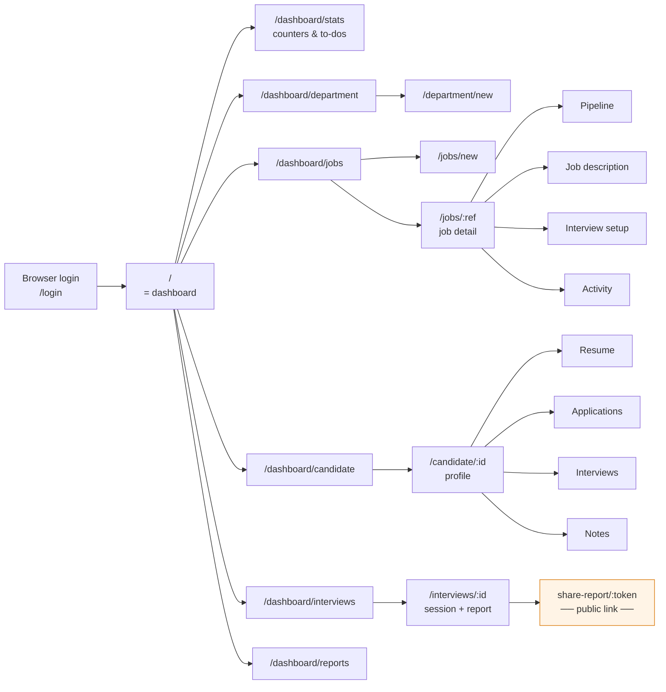

**Six destinations, not twelve.** The reference product had far more tabs, and
most of them were dismissed in the walkthrough. `Communication`,
`Questionnaire`, `Evaluation`, `BGV`, `Hiring Team` and `Document Manager` are
deliberately absent.

The orange box is the one surface a non-user ever sees: the **shareable report
link** — the same pattern as `erikahire.talentrecruit.com/share-report/<token>`
on the board. A hiring manager opens it with no account.

---

## 3. Act 0 — Setup

**Happens once per department, once per role. Everything else depends on it.**

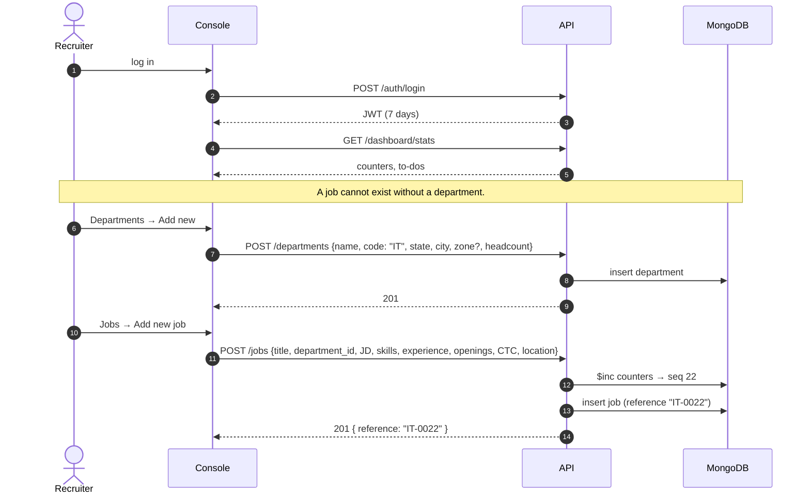

| When | What happens | Why it matters downstream |
|---|---|---|
| Department created | `code` fixed, e.g. `IT` | Becomes the prefix of every job reference |
| | `state` + `city` validated against a list | Stops "Borivli" — the location complaint on the board |
| | `zone` optional | Not mandatory for us |
| Job created | Reference allocated atomically → `IT-0022` | The code a recruiter reads out on a phone call |
| | **JD stored once** | Feeds **both** AI #1 (screening) and AI #2 (interview brief). One source, so you can never screen against one role and interview against another |
| | Skills list stored | Grounds the auto-generated interview questions |

> **Rule:** nothing else in this flow can start until a job exists. The job is
> the spine.

---

## 4. Act 1 — Source

**Trigger:** recruiter has a job and needs people in it.

Three entry points, mirroring the **Add Candidate** modal on the board:

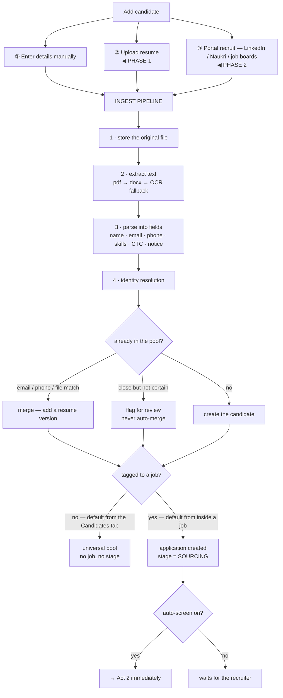

### What happens when

| Moment | Sync or async | What the recruiter sees |
|---|---|---|
| Files dropped | **Sync, < 2 s** | Rows appear instantly, greyed |
| Text extraction | Async, ~2 s/file | Row fills with a name |
| Parsing | Async, ~4 s/file | Skills, CTC, notice period appear |
| Dedupe | Async | "Already in pool — resume added" or a merge-review flag |
| Auto-screen | Async, ~8 s/file | Match badge appears |

> **Why upload returns in under 2 seconds.** A recruiter dropping 50 resumes
> should watch rows fill in, not stare at a spinner for four minutes. Everything
> after the byte-store is queued.

**The tagging rule** — this was explicit on the walkthrough:

- Uploading **from the Candidates tab** → tags nothing. Universal pool.
- Uploading **from inside a job** → tags that job automatically.
- Either is reversible, and one candidate can be tagged to many jobs. One
  person, many applications.

---

## 5. Act 2 — Screen · **AI #1**

**Trigger:** application exists at `SOURCING`. Auto-fires, or the recruiter
clicks *Screen all*.

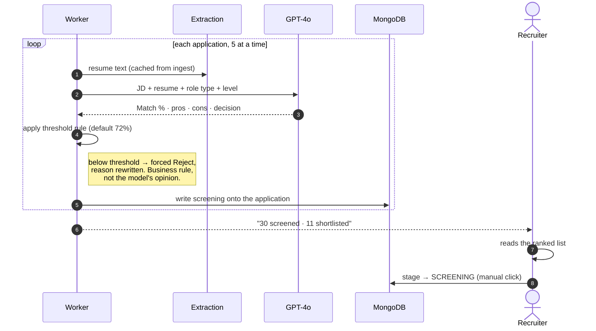

| Output | Where it lands | Looks like |
|---|---|---|
| Match % | Badge on the candidate row | `84%` — the matching badge on the board |
| Decision | Shortlisted / Rejected / Error | Colour chip |
| Write-up | Expandable on the row | Pros, cons, reason |
| Relevance rank | Sort order | The "AI suggestion" idea, as a sort — never a gate |

**Concurrency: 5 at a time.** Sequential would take ~6 minutes for 50 resumes;
bounded-parallel takes ~75 seconds. Unbounded would trip rate limits and end up
slower than both.

> **The recruiter still clicks.** The AI produces the number. Moving
> `SOURCING → SCREENING` is a human action, always. This was explicit:
> *"ye manually karna padega, wo automatically nahi hai."*

---

## 6. Act 3 — Engage and invite

**The branch point.** Two paths, and the short one is the default.

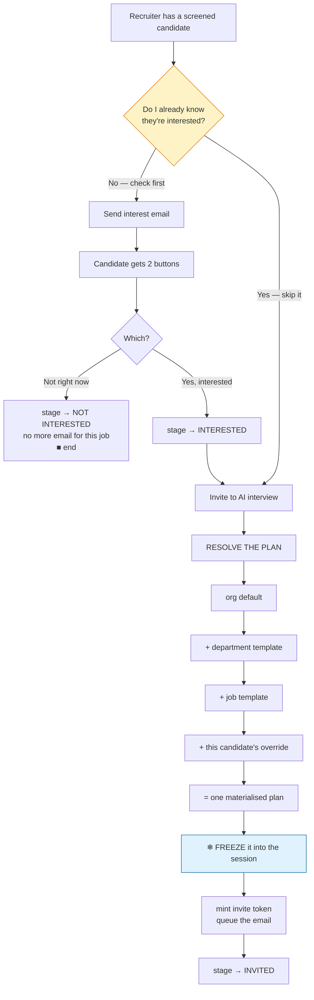

### The invite dialog — what the recruiter actually does

```
⋮ → Invite to interview
┌──────────────────────────────────────────┐
│  Interview · Priya Sharma · IT-0022       │
│  Using: IT · Experienced · Standard  [▾]  │
│  8 questions · moderate                   │
│                                           │
│  Language   [ English (en-IN)      ▾ ]    │
│             resume lists Hindi ·  use it  │
│  Duration   [ 30 minutes           ▾ ]    │
│                                           │
│  [ Customise for this candidate ]  ← G3   │
│                                           │
│           [ Cancel ]  [ Send invite ]     │
└──────────────────────────────────────────┘
```

**One click on the happy path.** No template configured? The system generates
questions from the JD + this candidate's resume, shows them, and saves them as
the job's template on first use. The recruiter ends up with something editable
they never had to write.

**Language and duration are per candidate, not per job.** Same `job_id`, same
template: one candidate can be interviewed in English for 30 minutes and the
next in Hindi for 15, with nothing cloned and nothing transferred. Both values
are ordinary layers in the resolution chain above, so they freeze into the
session with everything else — a report always states the language it was
actually conducted in. Two languages at launch, `en-IN` and `hi-IN`. Full
reasoning in [§11.8 of the system design](prohire-ats-system-design.md#118-language-and-duration-are-per-candidate).

### ❄ The freeze — the most important moment in the flow

At the instant the invite is sent, the plan is **copied into the session** along
with a snapshot of the job and the candidate.

| Because of the freeze | You get |
|---|---|
| Edit the job's questions tomorrow | Completed reports stay exactly as they were |
| Two candidates, same job, different questions | Both valid, no conflict |
| Two candidates, same job, **different languages and durations** | Both valid; each report says which language it was conducted in |
| Change your mind about strictness | **No cloning a job, no transferring candidates** |
| Open a report a year later | It still renders — even if the job was deleted |

That last row is the test. This is the direct answer to the loudest complaint on
the walkthrough: *"duplicate job banana padega, candidates transfer karne
padenge — waisa nahi karna hai."*

**Editing after invites are out:** if 12 people are invited-but-not-started, the
save dialog says so and offers *apply to new invites only* (default) or *also
re-freeze those 12*. Anyone already mid-interview is never touched.

---

## 7. Act 4 — The AI interview · **AI #2**

**Trigger:** the candidate opens the link. Could be 2 minutes or 5 days after
the invite. No scheduling, no recruiter present.

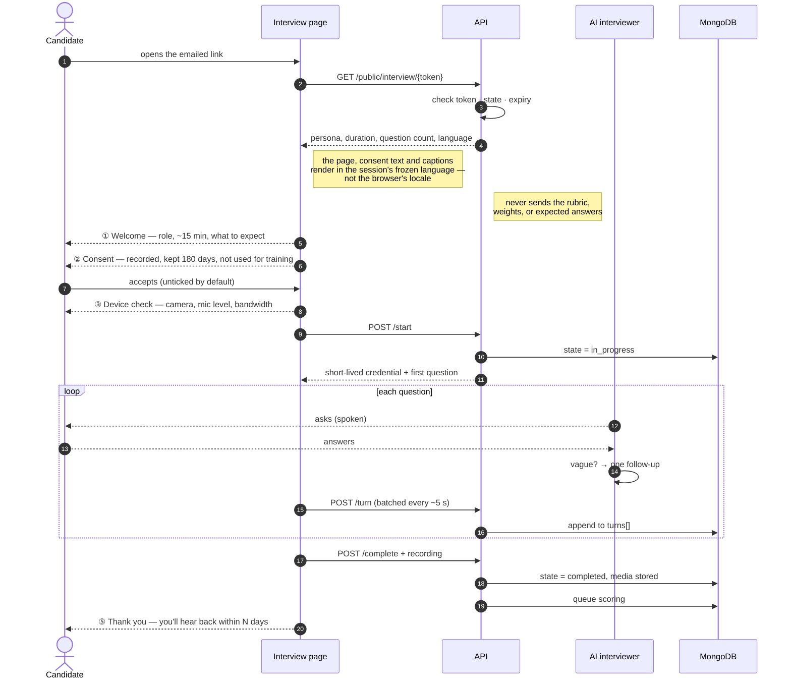

### What the candidate sees, screen by screen

| # | Screen | Must have |
|---|---|---|
| 1 | Welcome | Role name, duration, "this is an AI interviewer" — stated, never disguised |
| 2 | Consent | Unticked by default; declining is equally prominent and **is not a rejection** |
| 3 | Device check | Camera preview, live mic bar, connection test |
| 4 | Interview | **"Question 3 of 5"**, time remaining, live captions, a working *End* button |
| 5 | Thank you | What happens next, by when |

### When things go wrong — the ladder

The page walks down this automatically and says so in one sentence.

| Condition | What happens |
|---|---|
| Slow connection | Recording drops to 360p, audio unchanged |
| No camera / heavy loss | **Audio-only** — scoring unaffected |
| WebRTC unavailable | **Turn-based mode** — record one answer at a time |
| No mic at all | **Text interview** — and the communication score is *omitted*, not faked |
| Connection dies mid-answer | "Reconnecting — your answers are saved." Resumes at the same question |
| Tab closed entirely | `abandoned` after 30 min. Answered questions **still get scored** |
| Nothing works | *Request a callback* → flagged for a human |

> **Resumability is not a nicety.** State lives in the database, never in server
> memory — so a dropped connection, a crashed browser, or a mid-interview deploy
> all resume at the first unanswered question.

**Never started at all:** reminder at 48 h, another before expiry, then the
invite expires and the recruiter is told. The session is marked expired, never
deleted — "she never started it" is information.

---

## 8. Act 5 — Score and report

**Trigger:** session completes. **The candidate has already left.** Nothing here
blocks anyone.

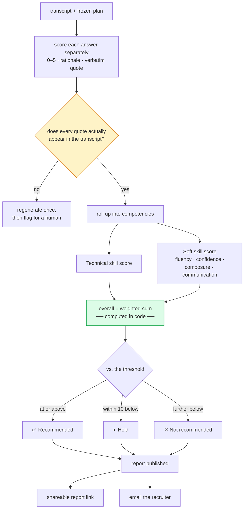

**Target: the report is ready within 3 minutes of the candidate clicking
*Finish*.** Answers are scored as they arrive during the interview, so by the
time it ends only the synthesis remains.

### What the report contains

Matching the shape on the board, with the additions that make it trustworthy:

| Section | Content |
|---|---|
| Header | Name, phone, experience, **sourced via**, interviewed on, duration, strictness tag |
| Outcome | **Recommended / Hold / Not recommended** + one-line headline |
| Overall scores | **Technical skill score** · **Soft skill score** |
| Soft-skill breakdown | Fluency · Confidence · Composure · Communication |
| Technical breakdown | Per-skill scores (the radar chart) |
| **Facts panel** | Notice period · expected CTC · location — often the first thing read |
| **Strengths / Concerns** | ← *new* |
| **Evidence** | Every score quotes the transcript ← *new, and the point* |
| **Ask in the next round** | Suggested follow-ups ← *new* |
| Attachments | Recording · full transcript · resume |
| Actions | **Shortlist · Hold · Reject** |

> **Two things the reference report does not have, and this one must.**
> **Evidence** — a number with no quote behind it invites a recruiter to stop
> thinking, and can't be challenged when a candidate disputes a rejection.
> **A verified quote** — citations are checked mechanically against the
> transcript, because invented evidence is the single most dangerous failure
> this system can produce.

**Not shown:** sentiment analysis. It's computed and stored, but kept off the
report — *"iska mein kya hi karungi mujhe bhi nahi pata."* It's the kind of
number that starts as decoration and ends up in someone's decision.

---

## 9. Act 6 — Decide and close

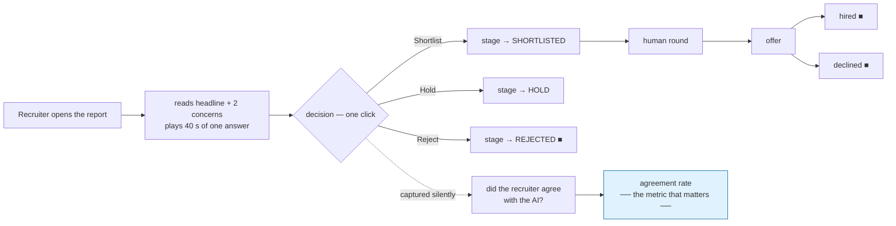

That last arrow is quiet but important. Every verdict records whether the
recruiter agreed with the AI. Aggregated, it answers the only question that
decides whether this product survives: **do recruiters believe the reports?**
Below ~70% agreement, the AI is costing time rather than saving it, and the
prompts need work. No extra clicks — it's derived from which button they press.

---

## 10. The application state machine

One canonical picture of every state and who causes each move.

```mermaid
stateDiagram-v2
    direction LR
    [*] --> SOURCING: resume ingested
    SOURCING --> SCREENING: recruiter, after AI #1
    SCREENING --> INTEREST_SENT: recruiter (optional)
    INTEREST_SENT --> INTERESTED: candidate clicks
    INTEREST_SENT --> NOT_INTERESTED: candidate clicks
    SCREENING --> INVITED: recruiter — skips the interest check
    INTERESTED --> INVITED: recruiter
    INVITED --> IN_PROGRESS: candidate starts
    INVITED --> EXPIRED: system, after TTL
    IN_PROGRESS --> COMPLETED: system
    IN_PROGRESS --> ABANDONED: system, 30 min idle
    COMPLETED --> SHORTLISTED: recruiter
    COMPLETED --> HOLD: recruiter
    COMPLETED --> REJECTED: recruiter
    ABANDONED --> INVITED: recruiter re-invites
    EXPIRED --> INVITED: recruiter re-invites
    SHORTLISTED --> HUMAN_ROUND: recruiter
    HUMAN_ROUND --> OFFERED --> HIRED
    OFFERED --> DECLINED
    NOT_INTERESTED --> [*]
    REJECTED --> [*]
    HIRED --> [*]
    DECLINED --> [*]
```

### Who moves what

| Mover | Transitions |
|---|---|
| **Recruiter** | Every stage change. All of them. Always |
| **Candidate** | Interest response · starting · finishing |
| **System** | Only session sub-state: `in_progress`, `completed`, `abandoned`, `expired` — displayed beside the stage, never *as* the stage |

The system **may suggest** — *"AI recommends: Shortlist (81%)"* with a one-click
accept. Suggesting is not moving.

---

## 11. Instant vs. background

Getting this split right is most of what makes the product feel fast.

```mermaid
flowchart LR
    subgraph SYNC["INSTANT — user is waiting"]
        S1["log in"]
        S2["create department / job"]
        S3["upload files — bytes stored"]
        S4["every list & filter"]
        S5["open a report"]
        S6["stage change"]
        S7["issue an invite"]
    end
    subgraph ASYNC["BACKGROUND — user has moved on"]
        A1["extract + parse resumes"]
        A2["dedupe"]
        A3["screening — AI #1"]
        A4["send every email"]
        A5["score the interview — AI #2"]
        A6["build the report"]
        A7["reminders · expiry · retention"]
    end
    SYNC -.->|"queued"| ASYNC
    ASYNC -.->|"notify / row updates"| SYNC
```

| Target | Why |
|---|---|
| Any click → **< 400 ms** | Anything slower feels broken |
| 50-resume upload accepted → **< 2 s** | Bytes stored, rest queued |
| 50 resumes screened → **< 4 min** | 5 concurrent |
| Interview report ready → **< 3 min** | Scored during the interview |
| Email delivery | Queued with retry — an SMTP blip delays an invite, never loses it |

**The rule:** if the person who triggered the work has left the screen, it
belongs in the background. The candidate closes the tab the instant the
interview ends — so scoring can never be part of that request.

---

## 12. Every branch, in one table

| # | Branch point | Condition | What happens |
|---|---|---|---|
| 1 | Ingest | Unreadable file | Candidate created from the filename, flagged *Needs review*. Batch continues |
| 2 | Ingest | Email or phone already known | Auto-merge, resume added as a new version |
| 3 | Ingest | Similar name only | **Flagged, never auto-merged** — two Rahul Sharmas at TCS is not rare |
| 4 | Ingest | No job context | Universal pool, no application |
| 5 | Screening | Below the threshold | Forced Reject with a rewritten reason — a business rule, not the model's call |
| 6 | Screening | API failure | 2 retries, then `Error` on that row only |
| 7 | Engage | Interest already known | **Skip straight to the invite** |
| 8 | Engage | Not interested | Terminal for this job; email suppressed permanently |
| 9 | Invite | Session already active | `409` — cancel or resend, never a silent second invite |
| 10 | Invite | Must-ask questions exceed the time budget | Rejected **at resolve time**, in front of the recruiter — not mid-interview |
| 11 | Invite | Candidate has no email | Blocked, unless the recruiter copies the link manually |
| 12 | Interview | Consent declined | Session closed, **not a rejection**; recruiter offered a human call |
| 13 | Interview | Slow / no camera / no mic | Degrade one rung at a time, tell the candidate |
| 14 | Interview | Disconnect | Resume at the same question, up to 3 times |
| 15 | Interview | Never started | 2 reminders → expire → recruiter told |
| 16 | Interview | Abandoned mid-way | Score what exists; recruiter can re-invite |
| 17 | Scoring | A quote isn't in the transcript | Regenerate once, then flag — never publish unverified evidence |
| 18 | Scoring | Task fails 3× | Recruiter notified with a *Retry* button |
| 19 | Report | Score near the line | `Hold`, not a forced binary — borderline candidates are where the real hires hide |
| 20 | Report | Recording expired (180 d) | Report still renders, notes the recording is gone |

---

## 13. A day in the life

One real timeline, to make the whole thing concrete.

| Time | Who | What | State after |
|---|---|---|---|
| 09:02 | Asha | Creates job *ASP.NET Developer* | `IT-0022` live |
| 09:10 | Asha | Drags 30 resumes into the job | 30 × `SOURCING` |
| 09:10 | System | Upload accepted — **8 seconds** | Rows greyed |
| 09:12 | System | Parsed. 2 were already in the pool | 28 new candidates |
| 09:14 | System | **AI #1 done.** 11 shortlisted | Badges: 84%, 79%, 76%… |
| 09:20 | Asha | Skims 11, picks 8 | 8 × `SCREENING` |
| 09:22 | Asha | Invites all 8. Ticks *Light mode* | 8 × `INVITED`, 8 plans frozen |
| 09:23 | System | 8 emails sent | — |
| 11:40 | Priya | Opens the link on her phone. Consents. Slow 4G → recording drops to 360p | `IN_PROGRESS` |
| 11:49 | Priya | 12 s dropout at minute 9 → *"Reconnecting — your answers are saved"* → resumes | `IN_PROGRESS` |
| 11:54 | Priya | Finishes. 13 min 40 s | `COMPLETED` |
| 11:56 | System | **AI #2 done.** 78/100 · Recommended · all quotes verified | Report live |
| 11:56 | System | "Report ready" email to Asha | — |
| 14:15 | Asha | Reads headline + 2 concerns, plays 40 s of one answer, clicks **Shortlist** | `SHORTLISTED` |
| 14:15 | System | Records: recruiter agreed with the AI | Trust metric +1 |
| — | | **Asha's total time on Priya: under 4 minutes.** | |

By 18:00, six of the eight have interviewed. Asha has spent roughly 25 minutes
on what used to be **four hours of scheduled calls**.

That gap — multiplied by every candidate, every role — is the entire business
case.

---

## 14. What the flow says about build order

The flow answers a question the design document deliberately left open: what do
you build first?

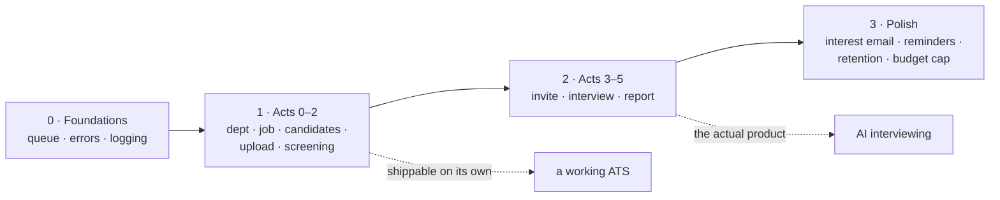

Two sequencing calls worth stating plainly:

1. **Acts 0–2 ship as a standalone product.** If the interview engine slips, the
   ATS still lands and is useful on its own. That is not an accident of ordering
   — it is insurance.

2. **Inside Act 4, build the turn-based mode before the realtime one.** It is
   less impressive and it is the right order: it proves the whole
   plan → conduct → transcript → score → report chain with simple, debuggable
   plumbing. Realtime then swaps exactly one component. Starting with realtime
   means debugging WebRTC and scoring at the same time, and you will not know
   which one is lying to you.

---

## 15. The flow in one sentence per act

> **0.** Make a department, then a job — the job's JD is the single source both
> AI steps read from.
> **1.** Get resumes in; parse them; tagging to a job is optional.
> **2.** **AI #1** scores every resume against the JD and ranks them.
> **3.** Invite whoever is worth interviewing — the plan is frozen at that
> instant, so it can be edited forever after without touching history.
> **4.** **AI #2** interviews them, whenever they like, on whatever device they
> have, degrading gracefully all the way down to text.
> **5.** Score it, evidence every claim, publish a shareable report.
> **6.** The recruiter clicks one button — and that click tells us whether the
> AI is earning its place.

---

*Companion to [prohire-ats-system-design.md](prohire-ats-system-design.md) ·
11 September 2026*
