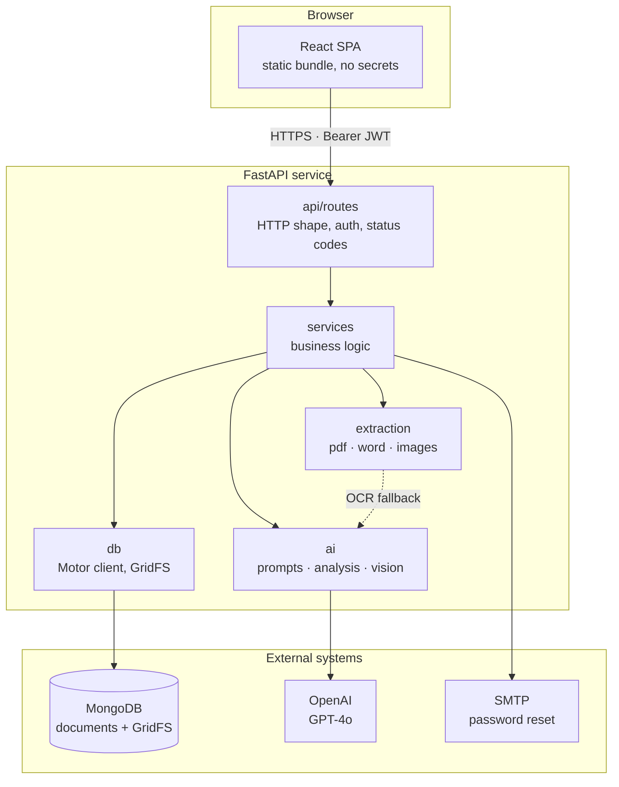
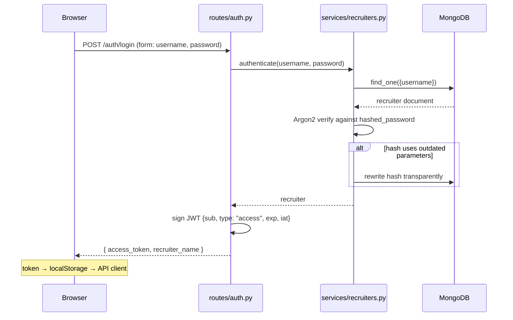
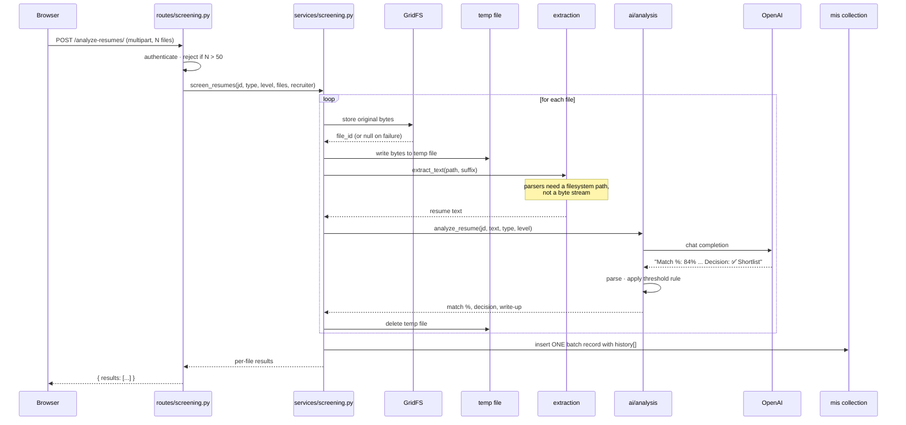
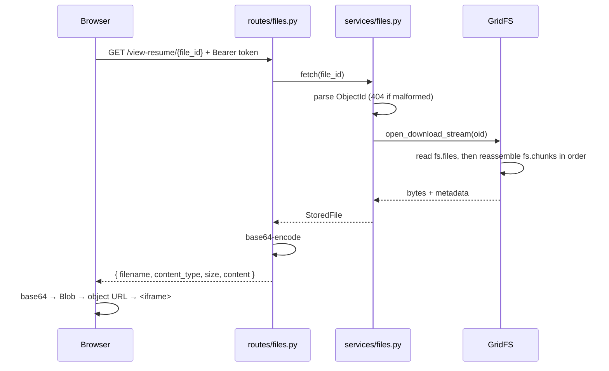
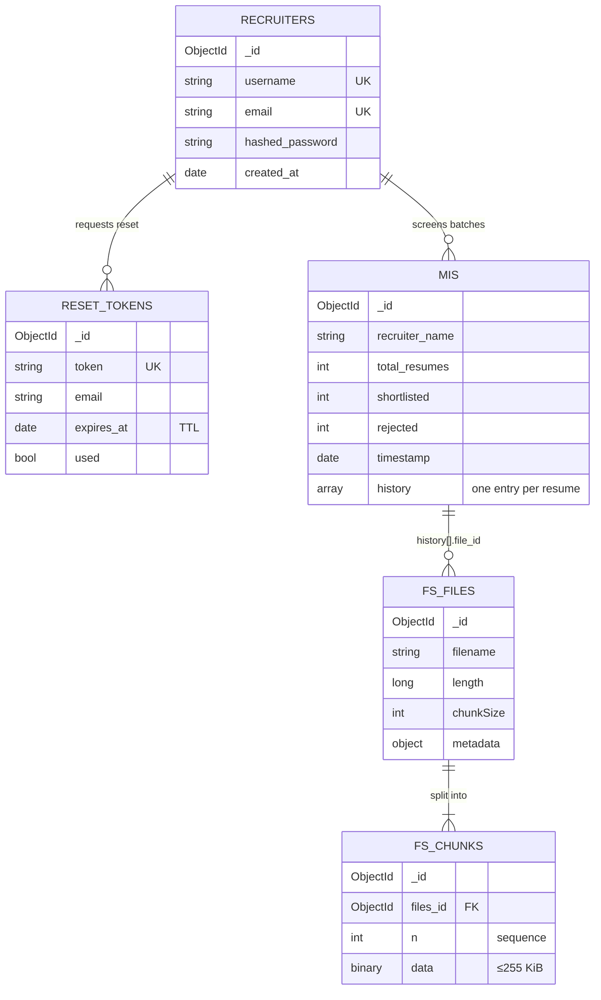
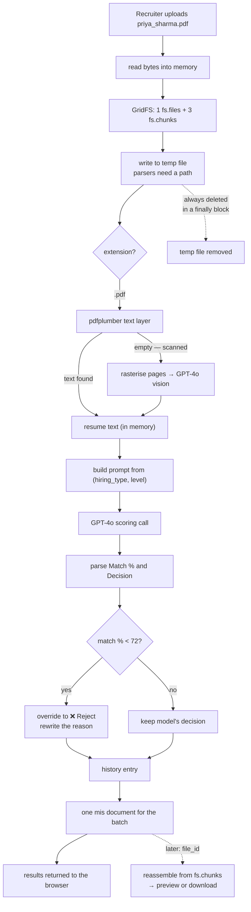

# System design

How ProHire is put together, what happens on each request, and how everything
is stored.

- [Context](#context)
- [Component architecture](#component-architecture)
- [Request flows](#request-flows)
- [How data is stored](#how-data-is-stored)
- [How resumes are stored](#how-resumes-are-stored)
- [The full lifecycle of one resume](#the-full-lifecycle-of-one-resume)
- [Failure modes](#failure-modes)
- [Bottlenecks and scaling](#bottlenecks-and-scaling)
- [Security design](#security-design)

## Context

A recruiter pastes a job description, picks a role type and experience level,
and uploads a batch of resumes. For each resume the system returns a match
percentage, a shortlist/reject decision, and the reasoning behind it. Every
screening is recorded so managers can report on activity.

The workload is **I/O-bound, not compute-bound**. Almost all wall-clock time is
spent waiting on the OpenAI API. That single fact drives most of the design
decisions below.

| Constraint | Consequence |
|---|---|
| One model call per resume, seconds each | Screening is a long request; the UI must show progress and the batch is capped |
| Resumes arrive in arbitrary formats | Extraction is a chain of fallbacks, not one call |
| Recruiters must re-read the original resume later | Files are stored, not just their extracted text |
| Screening records are nested and variable | Document database rather than relational |

## Component architecture



Dependencies run strictly downward. A route never touches the database; a
service never knows about HTTP status codes. That boundary is what lets the
business logic be tested without a running server — all 54 tests run with no
database and no API key.

## Request flows

### Signing in



There is no session table. The token *is* the session — every later request is
verified by signature alone, which is what allows the service to scale
horizontally without shared session state.

### Screening a batch

The core flow.



Blocking work — every parser and the OpenAI SDK are synchronous — is dispatched
through `run_in_threadpool`, so one slow batch does not stall every other
request on the server.

### Viewing a stored resume



The preview endpoint returns base64 rather than raw bytes because the viewer is
a modal inside an authenticated SPA — an `<iframe src="/download-resume/...">`
would issue a plain browser request carrying no `Authorization` header.

## How data is stored

MongoDB, database `resume_screening`. Four collections plus two that GridFS
manages.



### Why a document database

The screening record is the reason. One batch produces a variable-length array
of per-resume results, each holding a free-text write-up from the model. In a
relational schema that is a `batches` table, a `results` table, a join on every
read, and a migration whenever the result shape changes.

Here it is one document, written once and read whole:

```js
{
  _id: ObjectId("66f1..."),
  recruiter_name: "asha",
  total_resumes: 3,
  shortlisted: 1,
  rejected: 2,
  timestamp: ISODate("2026-09-08T07:12:44Z"),
  history: [
    {
      resume_name: "priya_sharma.pdf",
      hiring_type: "Sales",          // label, not the numeric code
      level: "Fresher",
      match_percent: 84,
      decision: "Shortlisted",
      details: "Match %: 84%\nPros:\n- 2 years field sales...",
      file_id: "66f1a2b3c4d5e6f7a8b9c0d1"
    },
    { resume_name: "broken.doc", decision: "Error", details: "Unable to extract...", file_id: null }
  ]
}
```

Three deliberate choices in that shape:

**One document per batch, not per resume.** A batch is written once and read
whole. Splitting it would multiply writes on the hot path for no read benefit.

**Labels, not codes.** `"Sales"` rather than `"1"`, so a record stays readable
if the numeric codes are ever remapped.

**`counts_per_day` is absent.** It appears in API responses but is computed at
read time by `build_mis_summary()`. Storing it would mean rewriting historical
documents every time a new resume is screened that day.

### Reporting reads

Both report queries are server-side aggregations, so Mongo does the grouping:

```js
// GET /reports/2026-09-08
[
  { $match: { timestamp: { $gte: dayStart, $lt: dayEnd } } },   // uses timestamp index
  { $group: { _id: "$recruiter_name",
              total_resumes: { $sum: "$total_resumes" },
              shortlisted:   { $sum: "$shortlisted" },
              rejected:      { $sum: "$rejected" } } },
  { $sort: { _id: 1 } }
]
```

`/mis-summary` is different — it needs full history, so it walks every record
once in `timestamp` order and accumulates in memory. That is fine at current
volume and is the main thing to revisit as data grows; see
[Bottlenecks](#bottlenecks-and-scaling).

## How resumes are stored

The original file goes into **GridFS**, MongoDB's convention for storing
binaries larger than a document can hold.

### Why not a plain document field

A MongoDB document is capped at **16 MB**. A resume is usually well under that,
but a scanned multi-page PDF is not reliably so, and a single oversized upload
would fail the write. GridFS removes the ceiling by splitting the file across
many small documents.

### The two collections

GridFS is not a special storage engine — it is a convention over two ordinary
collections.

**`fs.files`** — one document per file, the manifest:

```js
{
  _id: ObjectId("66f1a2b3c4d5e6f7a8b9c0d1"),   // ← this is the `file_id` in mis.history
  filename: "priya_sharma.pdf",
  length: 614400,             // total bytes
  chunkSize: 261120,          // 255 KiB
  uploadDate: ISODate("2026-09-08T07:12:41Z"),
  metadata: {                 // written by services/files.py
    content_type: "application/pdf",
    upload_date: ISODate("2026-09-08T07:12:41Z"),
    recruiter_name: "asha",
    file_size: 614400
  }
}
```

**`fs.chunks`** — the bytes, split into ordered pieces:

```js
{ _id: ObjectId("..."), files_id: ObjectId("66f1a2..."), n: 0, data: BinData(0, "...") }
{ _id: ObjectId("..."), files_id: ObjectId("66f1a2..."), n: 1, data: BinData(0, "...") }
{ _id: ObjectId("..."), files_id: ObjectId("66f1a2..."), n: 2, data: BinData(0, "...") }
```

`n` is the sequence number. Reassembly is: find all chunks with this `files_id`,
sort by `n`, concatenate `data`.

### Worked example

A 600 KiB PDF (614,400 bytes) at the default 255 KiB chunk size:

```
                        614,400 bytes total
   ┌──────────────────┬──────────────────┬───────────┐
   │   chunk n=0      │   chunk n=1      │ chunk n=2 │
   │  261,120 bytes   │  261,120 bytes   │   92,160  │
   └──────────────────┴──────────────────┴───────────┘
```

`ceil(614400 / 261120) = 3` documents in `fs.chunks`, plus 1 in `fs.files`.
The final chunk holds the remainder; only it is short.

| File size | Chunks | Documents written |
|---|---|---|
| 80 KB (typical DOCX) | 1 | 2 |
| 600 KB (typical PDF) | 3 | 4 |
| 4 MB (scanned PDF) | 17 | 18 |

### Writing

```python
file_id = await get_gridfs_bucket().upload_from_stream(
    filename,
    content,
    metadata={
        "content_type": content_type or "application/octet-stream",
        "upload_date": upload_date,
        "recruiter_name": recruiter_name,
        "file_size": len(content),
    },
)
```

The driver writes the chunks first, then the `fs.files` manifest last. That
ordering matters: an interrupted upload leaves orphaned chunks with no manifest,
which is wasted space but never a corrupt readable file. There is no partially
readable state.

`upload_from_stream` returns an `ObjectId`. It is stored as a **string** in
`mis.history[].file_id`, and parsed back to an `ObjectId` on retrieval — which
is why `fetch()` catches `InvalidId` and turns a malformed id into a clean 404
rather than a 500.

### Storage is best-effort

```python
except Exception as exc:
    logger.error("Failed to store %s in GridFS: %s", filename, exc)
    return None
```

If GridFS is unavailable the screening still runs and still returns results;
that history entry simply carries `file_id: null` and the resume name renders
without a link. A storage outage should not cost a recruiter the analysis they
waited minutes for.

### What is not stored

**Extracted text is never persisted separately.** It lives only in memory during
the request. What survives is the model's write-up in `history[].details` and
the original file in GridFS. Re-extracting is always possible from the original;
caching the intermediate text would add a consistency problem for no gain.

**Nothing is ever deleted.** No retention policy exists. See
[Bottlenecks](#bottlenecks-and-scaling).

## The full lifecycle of one resume



The threshold override is the one place the system overrules the model. Below
`MATCH_THRESHOLD` (default 72), the decision becomes Reject regardless of what
GPT-4o concluded, and the **rewritten** text is what gets stored — so history
always reflects the rule that was actually applied, not the model's opinion
before it.

## Failure modes

Designed so that a failure degrades the smallest possible unit of work.

| Failure | Blast radius | Behaviour |
|---|---|---|
| One resume unreadable | That resume | `decision: "Error"`, batch continues |
| OpenAI call fails | That resume | Same — `AnalysisError` caught per file |
| GridFS write fails | That resume's link | Screening completes, `file_id: null` |
| Temp file write fails | That resume | Cleanup runs in a `finally` block regardless |
| SMTP down | Password reset only | 502 on that endpoint; nothing else affected |
| An index cannot build | Nothing | Logged and skipped; startup continues |
| MongoDB unreachable at boot | Everything | Startup aborts loudly rather than failing per-request |
| MongoDB unreachable later | Everything | `/health` returns 503 so a load balancer can evict the instance |

The deliberate asymmetry: **per-resume failures are contained, infrastructure
failures are loud.** A bad file is normal operation and should not page anyone.
A missing database is not.

## Bottlenecks and scaling

### The dominant cost

One GPT-4o call per resume, issued sequentially, each taking seconds. A
20-resume batch takes minutes. Everything else in the request is noise by
comparison.

The batch is capped at 50 files (`MAX_FILES_PER_BATCH`). The natural next
improvement is to screen files **concurrently** with a bounded semaphore —
the calls are independent, and the loop in `screen_resumes` is the only thing
making them sequential. Bound it, or a 50-file batch will hit rate limits.

### `/mis-summary` grows linearly

It reads every record ever written and accumulates history in memory. Today's
volume makes that fine; it will not stay fine. Three options, in order of
effort:

1. Paginate history per recruiter — the UI shows a card at a time anyway.
2. Date-bound the query, defaulting to the last N days.
3. Maintain a rolling per-recruiter totals document, updated on write.

### GridFS grows without limit

Every resume ever uploaded is retained. At roughly 300 KB average, 10,000
resumes is about 2.9 GB across 20,000 chunk documents plus 10,000 manifests. Nothing deletes them.

A retention policy — drop files older than N months, keep the history entries —
is the cheapest fix, and `history[].file_id` already tolerates `null`, so the
UI needs no change.

### What scales fine already

**The service is stateless.** JWTs carry the session, so instances can be added
behind a load balancer with no shared store.

**Report queries are server-side aggregations** using the `timestamp` index —
those stay cheap as data grows.

**Concurrency within an instance** is already handled: blocking work runs in a
threadpool, so the event loop keeps accepting requests during a long batch.

## Security design

| Concern | Approach |
|---|---|
| Password storage | Argon2id — no 72-byte input ceiling, unlike bcrypt, which silently truncates. Hashes upgrade transparently on login |
| Session | Stateless JWT, 7 days, `type` claim so a reset token cannot be replayed as a login token |
| Weak signing key | App refuses to start if `JWT_SECRET` is under 32 characters |
| Password reset | Requires both a valid signature *and* an unused, unexpired row — the row is what makes it single-use |
| Email enumeration | `/forgot-password` returns an identical message whether or not the address exists |
| Reporting endpoints | Authenticated — they expose every recruiter's activity |
| File access | Both file endpoints require a token; ids are `ObjectId`s, not paths, so there is no traversal surface |
| Error leakage | Unhandled exceptions log server-side and return an opaque message |
| Secrets | Environment only. `.env` and `ssl/` are gitignored; `.env.example` documents the shape with blank values |
| CORS | Explicit origin allowlist, not a wildcard |

### Known gaps

Worth naming rather than leaving implied:

- **No rate limiting.** Login and `/forgot-password` are both unauthenticated
  and unthrottled.
- **No per-recruiter file authorisation.** Any authenticated recruiter can fetch
  any `file_id`. Reporting is org-wide by design, so this is consistent — but it
  is a choice, not an oversight, and would need revisiting for multi-tenancy.
- **Tokens cannot be revoked** before expiry, which is inherent to stateless
  JWTs. Rotating `JWT_SECRET` invalidates all of them at once.
- **No audit log** of who viewed which resume.
